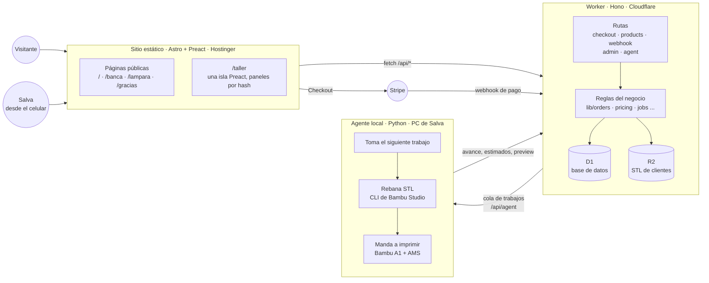
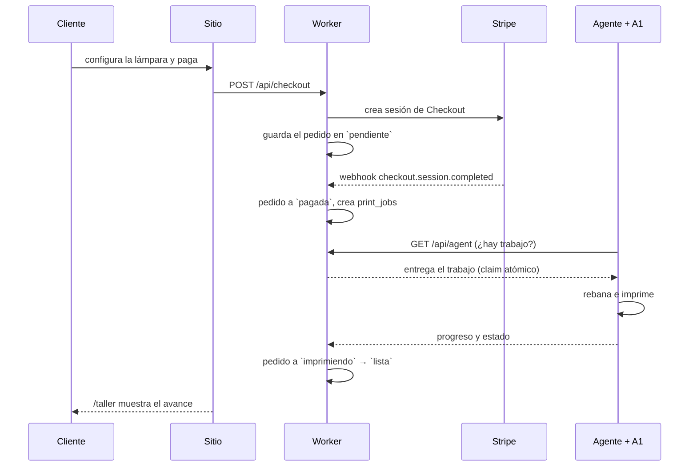
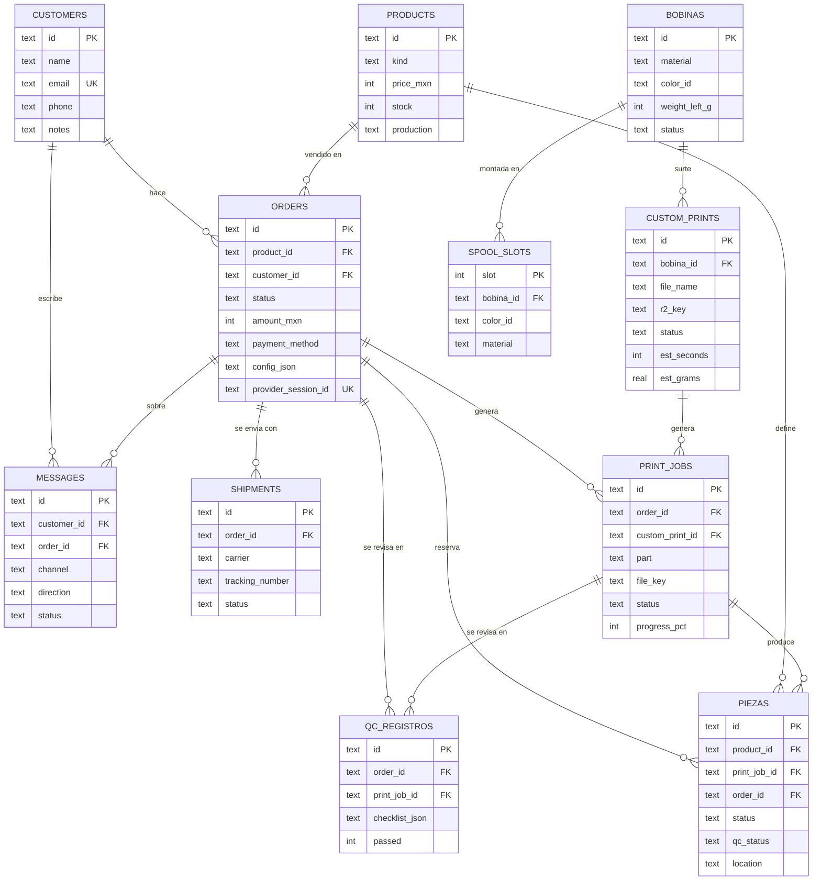

# Arquitectura de forma — mapa vivo del sistema

Retrato de **lo que existe hoy**, en español llano, para entender cómo encaja
todo sin leer el código. No es un plan ni una propuesta: lo planeado vive en
`docs/ROADMAP_ARQUITECTURA.md`, `docs/AGENTE_IA.md` y `docs/NEGOCIO.md`.

Los diagramas son Mermaid; GitHub los dibuja solo al abrir este archivo.

**Cómo se mantiene:** se actualiza en el mismo PR que introduce el cambio,
siguiendo la regla de `CLAUDE.md` (§ "Mantener el mapa de arquitectura"). Si
este archivo contradice al código, el código gana y el archivo está en deuda.

---

## 1. Las tres piezas

Todo lo que existe vive en uno de tres lugares. Se hablan por HTTP y cada uno
puede fallar o desplegarse sin tumbar a los otros dos.



| Pieza | Dónde vive | Cómo se despliega |
| --- | --- | --- |
| Sitio (`src/`) | Hostinger | Automático al mergear a `master` |
| Worker (`workers/api/`) | Cloudflare Workers | `npm run deploy` con wrangler, **antes** del merge del sitio |
| Agente (`agent/`) | PC de Salva, junto a la impresora | A mano, en esa máquina |

La base de datos es **D1** (SQLite administrado de Cloudflare). Solo el Worker
la toca: ni el sitio ni el agente hablan con ella directo.

---

## 2. El viaje de un pedido



**Estados de un pedido** (grafo en `workers/api/src/lib/orders.ts`):

```
pendiente → pagada → en_cola → imprimiendo → lista → enviada
                                                  ↘ cancelada
```

- Pago con **OXXO** entra en `pendiente` y sube a `pagada` cuando Stripe avisa.
- Los productos con `production='manual'` (madera) nunca pasan por la
  impresora: se muestran como "En progreso" hasta `lista`.
- El webhook es **idempotente**: `webhook_events` guarda cada `evt_` de Stripe
  para que un reintento no duplique nada.
- Tras cada impresión real la cama queda marcada como ocupada
  (`printer_flags.bed_clear = 0`) y el agente no recibe más trabajos hasta que
  Salva confirme en /taller que la despejó.

---

## 3. La base de datos

23 migraciones aplicadas, agrupadas en tres temas. Convenciones vigentes:
IDs de texto con prefijo (`ord_`, `cus_`, `job_`), dinero **en centavos**,
fechas en texto ISO, y los enums que crecen se validan en `lib/`, no con
`CHECK` en D1.



### Dinero y pedidos

| Tabla | Qué guarda |
| --- | --- |
| `products` | Catálogo: la lámpara configurable y las piezas únicas de madera, con precio y stock. |
| `orders` | Cada pedido: qué, cuánto, quién y en qué paso va. Los `customer_*` son foto histórica del momento de la compra. |
| `webhook_events` | Libro de idempotencia de Stripe: un `evt_` visto no se procesa dos veces. |
| `pricing_config` | Una sola fila con los costos de la calculadora de precio: luz, watts, mano de obra, amortización de la impresora, margen. |

### Personas y conversación

| Tabla | Qué guarda |
| --- | --- |
| `customers` | Clientes normalizados: nombre, email (único), teléfono, notas. |
| `messages` | El inbox unificado: email, WhatsApp, web o captura manual. No hay tabla de hilos — `customer_id` + orden cronológico *es* el hilo. |

### Taller e inventario

| Tabla | Qué guarda |
| --- | --- |
| `print_jobs` | La cola de impresión: qué pieza, de qué color, en qué estado. Sirve tanto a lámparas (`order_id`) como a piezas de cliente (`custom_print_id`). |
| `custom_prints` | STL que suben los clientes. El archivo vive en R2; aquí solo metadatos, estimados del rebanado y estado. |
| `bobinas` | Almacén de filamento: material, color, gramos restantes, costo. |
| `spool_slots` | Las 4 ranuras del AMS: qué bobina está montada ahora mismo en la impresora. |
| `piezas` | Piezas terminadas en bodega: en stock, reservada, vendida o merma, con su ubicación. |
| `qc_registros` | Historial de revisiones de calidad. **Inmutable**: repetir una revisión es insertar otra fila. |
| `shipments` | Guías de envío por pedido. Un pedido puede tener varias (reenvíos); el historial no se edita. |
| `printer_flags` | Una sola fila: el candado de cama y las horas acumuladas de impresión. |

---

## 4. Cómo está organizado el código

```
formamx/
├── src/                        Sitio Astro
│   ├── pages/                  index · banca · lampara · gracias · taller
│   ├── components/
│   │   ├── LampConfigurator    configurador de lámpara (isla Preact)
│   │   ├── BuyBanca            checkout de pieza única
│   │   └── taller/             el dashboard: un panel por módulo
│   │       ├── resumen/ pedidos/ proyectos/ clientes/
│   │       ├── impresora/ inventario/ envios/
│   │       └── router.ts       paneles conmutados por location.hash
│   └── styles/brand.css        tokens de marca (espejo en ds-bundle/)
│
├── workers/api/                Backend
│   ├── src/routes/             checkout · products · webhook · agent
│   │   └── admin/              un archivo por módulo de /taller
│   ├── src/lib/                reglas del negocio (orders, pricing, jobs...)
│   └── migrations/             23 migraciones D1, un tema por archivo
│
├── agent/formamx_agent/        Agente local (Python)
│   ├── api.py                  habla con el Worker
│   ├── slicer.py               rebanado con el CLI de Bambu Studio
│   └── printer.py              habla con la Bambu A1
│
└── docs/                       Toda la documentación por área
```

**Regla de espejo:** un tema del taller tiene su panel en
`src/components/taller/<tema>/` y su archivo de rutas en
`workers/api/src/routes/admin/<tema>.ts`. Agregar un módulo es agregar ambos
lados (receta completa en `docs/ROADMAP_ARQUITECTURA.md`). El espejo no siempre
es 1 a 1 en la interfaz: `inbox` y `custom-prints` tienen sus rutas propias
pero se muestran dentro de los paneles de Clientes y Proyectos.

---

## 5. Fronteras y llaves

- **El sitio nunca toca D1.** Todo pasa por `/api/*` del Worker.
- **Tres puertas de entrada al Worker:** el público (checkout, products), el
  panel (`/api/admin/*`, bearer con `ADMIN_TOKEN`) y el agente (`/api/agent/*`,
  bearer con `AGENT_TOKEN`); la comparación del token es en tiempo constante.
  El webhook de Stripe se valida con firma, no con token.
- **CORS con lista cerrada:** solo `formamx.com` y `www.formamx.com` en
  producción; `localhost:4321` únicamente cuando el Worker corre en local.
  `/api/checkout` además tiene rate limit: 10 sesiones por IP cada 60 s.
- **Los STL viven en R2**, nunca en git ni en D1. El `.gcode.3mf` resultante se
  queda en el disco del agente.
- **Secretos:** en `wrangler secret` y `.dev.vars`, jamás en el repo.
- **Orden de deploy:** migración remota → deploy del worker → merge del sitio.

---

## 6. Lo que aún no existe

Para no confundir el mapa con el plan:

- Stripe sigue en **modo prueba**; el paso a live está en `docs/NEGOCIO.md` §1.
- Los avisos custom desde el Worker están rotos (ntfy bloquea a Workers). El
  reemplazo —outbox en D1 + bot de Telegram— es `docs/AGENTE_IA.md` fases B1-B2.
- El servidor de IA en la Mac mini está aprobado en plan, sin implementar.
- Lo legal y operativo para vender de verdad (privacidad, términos, CFDI,
  respaldos, CI, analytics) está planeado en `docs/NEGOCIO.md`.
